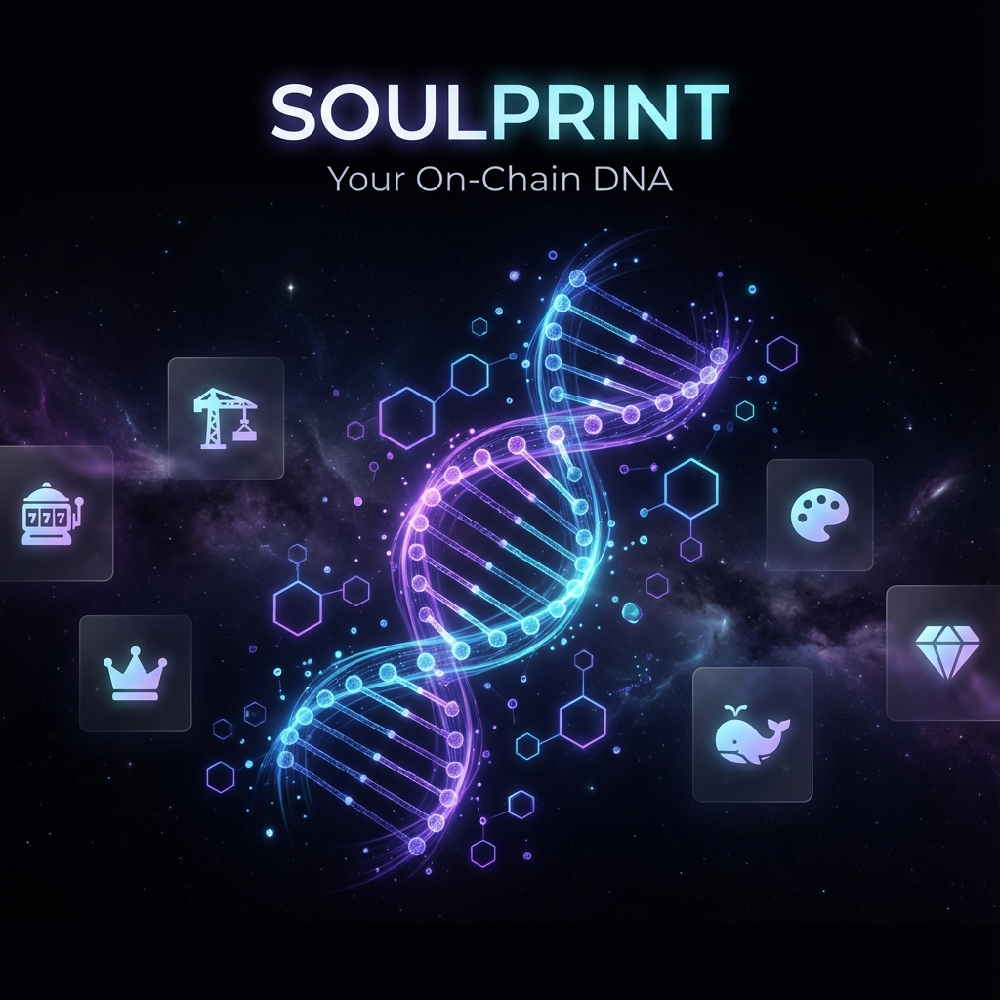

# 🧬 SOULPRINT - Your On-Chain DNA

A viral Farcaster Mini App that analyzes your blockchain activity to create a unique digital DNA fingerprint.



## ✨ Features

- **🧬 DNA Analysis** - Analyzes your wallet and Farcaster activity
- **📊 6 Personality Traits** - Builder, Degen, OG, Creator, Whale, Diamond
- **⭐ Rarity Scoring** - Unique score from 0-1000
- **🎨 Generative Visuals** - Beautiful animated DNA helix
- **📤 Share to Farcaster** - One-click sharing with embedded preview
- **💎 Mint as NFT** - Coming soon on Base

## 🚀 Quick Start

### Prerequisites

- Node.js 22.11.0 or higher
- npm, pnpm, or yarn
- A Farcaster account (for testing)

### Installation

```bash
# Clone the repository
git clone https://github.com/YOUR_USERNAME/soulprint.git
cd soulprint

# Install dependencies
npm install

# Run development server
npm run dev
```

Open [http://localhost:3000](http://localhost:3000) in your browser.

## 📦 Deploy to Vercel

1. Push your code to GitHub
2. Import the repository on [Vercel](https://vercel.com)
3. Deploy (no environment variables needed initially)
4. Note your deployment URL (e.g., `soulprint.vercel.app`)

## 🔧 Configure Farcaster Manifest

After deployment:

1. Go to [base.dev/preview](https://base.dev/preview)
2. Enter your app URL in the "Account association" tab
3. Click "Verify" and follow the prompts
4. Copy the generated `accountAssociation` object
5. Update `minikit.config.ts` with the credentials

```typescript
export const minikitConfig = {
  accountAssociation: {
    "header": "YOUR_HEADER",
    "payload": "YOUR_PAYLOAD", 
    "signature": "YOUR_SIGNATURE"
  },
  // ...
}
```

6. Push changes and redeploy

## 🎯 Publish to Farcaster

1. Create a cast with your app URL
2. The app will appear as an embedded mini app
3. Share and go viral! 🚀

## 📁 Project Structure

```
soulprint/
├── app/
│   ├── layout.tsx           # Root layout
│   ├── page.tsx             # Main page
│   ├── globals.css          # Styles
│   ├── api/webhook/         # Farcaster webhook
│   └── .well-known/         # Farcaster manifest
├── components/
│   ├── DNACard.tsx          # DNA result card
│   ├── DNAHelix.tsx         # 3D DNA visualization
│   ├── WelcomeScreen.tsx    # Welcome/CTA screen
│   └── LoadingAnimation.tsx # Loading state
├── lib/
│   ├── dnaAnalyzer.ts       # DNA analysis logic
│   ├── traits.ts            # Trait definitions
│   └── utils.ts             # Utilities
├── providers/
│   └── Provider.tsx         # Wagmi provider
├── public/                  # Static assets
└── minikit.config.ts        # Farcaster config
```

## 🛠️ Tech Stack

- **Framework**: Next.js 14 (App Router)
- **Styling**: Custom CSS (Glassmorphism, Dark Theme)
- **Animations**: Framer Motion
- **Blockchain**: Base (Coinbase L2)
- **SDK**: @farcaster/miniapp-sdk
- **Wallet**: Wagmi + Farcaster Mini App Connector

## 📄 License

MIT License - feel free to use and modify!

## 🙏 Credits

Built with ❤️ for the Farcaster community.

---

**Discover your blockchain DNA today!** 🧬
